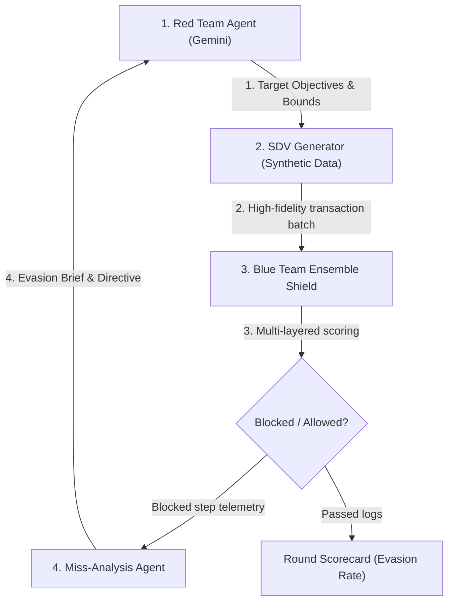

<p align="center">
  
</p>

<h1 align="center">VigilNet AI 🛡️⚡</h1>

[](https://www.python.org/)
[](https://react.dev/)
[](https://fastapi.tiangolo.com/)
[](https://www.mongodb.com/)
[](https://redis.io/)
[](https://ai.google.dev/)

> **Closed-Loop Red-Team / Blue-Team Multi-Agent Adversarial System for Payment Fraud Defense.** Developed for the **Mastercard Innovation Challenge 2026**.

VigilNet AI is a simulation and stress-testing system designed to evaluate and harden fraud detection algorithms against adaptive, intelligent financial adversaries. The platform pits a Gemini-driven **Red Team** (which dynamically designs evasion strategies) against a multi-layered **Blue Team Ensemble** (tabular, graph, sequence, and text models). A closed-loop feedback agent (the **Miss-Analysis Agent**) dynamically adjusts the next-round generative bounds for blocked actions, modeling a real-world evolving threat vector.

---

## 🏗️ Technical Architecture & Closed Loop

VigilNet operates on an automated, multi-agent closed loop:



### Core Backend Components & Mechanisms

1. **API Router Orchestration (`backend/app/routers/orchestrator.py`)**:
   * Exposes HTTP endpoints (`/orchestrator/simulate`) to trigger multi-round loops asynchronously.
   * Manages simulation threads using FastAPI background workers and maintains live state synchronization.

2. **Simulation Runner Pipeline (`backend/app/orchestrator/runner.py`)**:
   * Drives the orchestration sequence. For each round, it queries historical bounds, feeds them to the Red Team Gemini agent, triggers the SDV synthetic generator, feeds generated transactions through the detector ensemble, and logs results.
   * Calculates metrics (Evasion Rate, Blocked Steps) and compiles round documents.

3. **Closed-Loop Feedback & Miss-Analysis Agent (`backend/app/agents/base.py`)**:
   * Evaluates telemetry signatures for transactions that were flagged and blocked by the Blue Team.
   * Compiles a detailed, natural-language **Adversarial Evasion Brief**. This brief details exactly what went wrong (e.g., transaction amount was too high, velocity alert triggered, billing text contains phishing patterns).
   * Appends the evasion brief and a tactical directive as system instructions for the Red Team agent's next round run, forcing it to adaptively adjust transaction bounds.

4. **Multi-Layer Blue Team Ensemble (`backend/app/detectors/`)**:
   * **Tabular Shield (`tabular.py`)**: Evaluates numerical metrics, user balance ratios, and structural boundaries using an XGBoost classifier.
   * **Graph Shield (`graph.py`)**: Runs graph network analyses (GNN) to discover structure anomalies, smurfing pathways, and structured node clusters.
   * **Sequence Shield (`sequence.py`)**: Analyzes sequential patterns and timing offsets (Markov Chain / LSTM checks) to capture card-testing velocity waves.
   * **Text Shield (`text.py`)**: Employs Google Gemini semantic evaluations to parse unstructured BEC communication logs and false invoice descriptions.

5. **Database & Cache Layer (`backend/app/db/`)**:
   * **MongoDB Atlas**: Serves as the primary source of truth, storing permanent documents inside the `rounds` collection (timestamps, evasion rate, personas, events, and the compiled `evasion_brief`).
   * **Redis Cache**: Holds active live-loop logs, metrics parameters, and temporary session state for smooth rendering in the React front-end console.

---

## 📂 Project Structure

```
/VigilNet-AI
├── /backend
│   ├── /app
│   │   ├── /agents       # Red Team personas (Gemini-driven) & Miss-Analysis Agent
│   │   ├── /db           # MongoDB and Redis connection managers
│   │   ├── /detectors    # Blue Team detection models (XGBoost, GNN, Text-layer, etc.)
│   │   ├── /orchestrator # Loop Orchestrator & Round management
│   │   └── /routers      # API endpoints (e.g. /health, /score, /rounds)
│   ├── requirements.txt  # Python requirements
│   └── main.py           # FastAPI entrypoint
├── /frontend             # React (Vite) dashboard UI
│   ├── /src
│   │   ├── App.jsx       # Main dashboard application code
│   │   └── index.css     # Cyberpunk hacker design styles
│   └── package.json      # Node.js configurations
├── /images               # Brand assets and logo files
└── /scripts              # Utility and validation seeding scripts
```

---

## 🛠️ Local Development Setup

### 1. Prerequisites
- **Python 3.10+**
- **Node.js v18+** & **npm**
- **Docker Desktop** (for running Redis locally)
- **MongoDB Atlas** Account & Cluster (for database storage)
- **Google AI Studio** Account & API Key (for Gemini models)

### 2. Environment Configuration
Create a `.env` file in the project root:
```env
GEMINI_API_KEY=your_gemini_api_key_here
MONGODB_URI=your_mongodb_atlas_connection_string
MONGODB_DB_NAME=vigilnet
REDIS_URL=redis://localhost:6379
```

### 3. Spin up Infrastructure Services
Start a local Redis caching instance using Docker:
```powershell
docker run -d --name vigilnet-redis -p 6379:6379 redis:7-alpine
```

### 4. Backend Setup
Create and activate your Python virtual environment, then install dependencies:
```powershell
# In root directory
python -m venv .venv
.venv\Scripts\Activate.ps1   # Windows
# source .venv/bin/activate  # macOS/Linux

pip install -r backend/requirements.txt
```

Verify Gemini and database connectivity:
```powershell
python scripts/test_gemini.py
```

Start the FastAPI web server:
```powershell
uvicorn backend.main:app --reload --host 127.0.0.1 --port 8000
```
- **API Swagger Docs**: [http://127.0.0.1:8000/docs](http://127.0.0.1:8000/docs)
- **Health Check**: [http://127.0.0.1:8000/health](http://127.0.0.1:8000/health)

### 5. Frontend Setup
Install npm packages and run the Vite client dev server:
```powershell
cd frontend
npm install
npm run dev
```
Open [http://localhost:5173](http://localhost:5173) in your browser to view the interactive dashboard.

---

## 📊 Demo Day Guide & Seeding

To run a demo without depleting Gemini API key limits or encountering latency, you can populate the database with a pre-recorded campaign dataset.

### 1. Seeding Pre-Recorded Demo Data
To populate the database with a clean, presentable round-over-round evasion decay curve (3 rounds of progression for all 5 personas), run:
```powershell
python scripts/seed_demo_data.py
```
> [!NOTE]
> If your MongoDB already contains test rounds, the script will skip seeding by default to avoid overwriting them. To clear your database and start fresh with the clean demo curves, pass the `--clear` flag:
> `python scripts/seed_demo_data.py --clear`

### 2. Live Demo Run Safeguard
During the live demo on stage, you can trigger a live simulation round from the **Simulation Runner** tab:
- This will execute the dynamic Gemini-based Red Team agent planning, score it via the ensemble detector, and append the outcome directly to your charts.
- This is safe and does not disrupt the pre-recorded reference curves; it simply appends a new round at the end of the timeline.
- It is recommended to run a **2-round** challenge live to demonstrate the real-time feedback loop and adaptation.

---

## 🛡️ Control Center Views

- **Fraud Taxonomy**: Cyberthreat dictionary outlining active fraud vectors (Card Testing, BEC, Structuring, Identity Theft). Tapping any card opens a technical inspector window displaying mechanics, GNN telemetry fields, and SDV parameters.
- **Simulation Runner**: High-tech dashboard to trigger multi-round challenge loops. Select a persona, choose round bounds, customize objectives, and watch live execution logs scroll in the stdout console.
- **Metrics Curves**: Neon line charts rendering round-over-round Evasion rates vs Ensemble Recall rates, visualizing the adaptive learning degradation curve.
- **Evasion Replay**: Detailed audit portal to select past rounds and view full natural language Evasion Briefs and transaction scorecards.

---

## 👨‍💻 Author & Credits

Designed, engineered, and developed with ⚡ by **Riyanshi Verma** for the Mastercard Innovation Challenge 2026.

---

<p align="center" style="font-size: 0.8rem; color: var(--text-muted);">
  &copy; 2026 Riyanshi Verma. All rights reserved. Registered under Mastercard Innovation Challenge Specifications.
</p>

